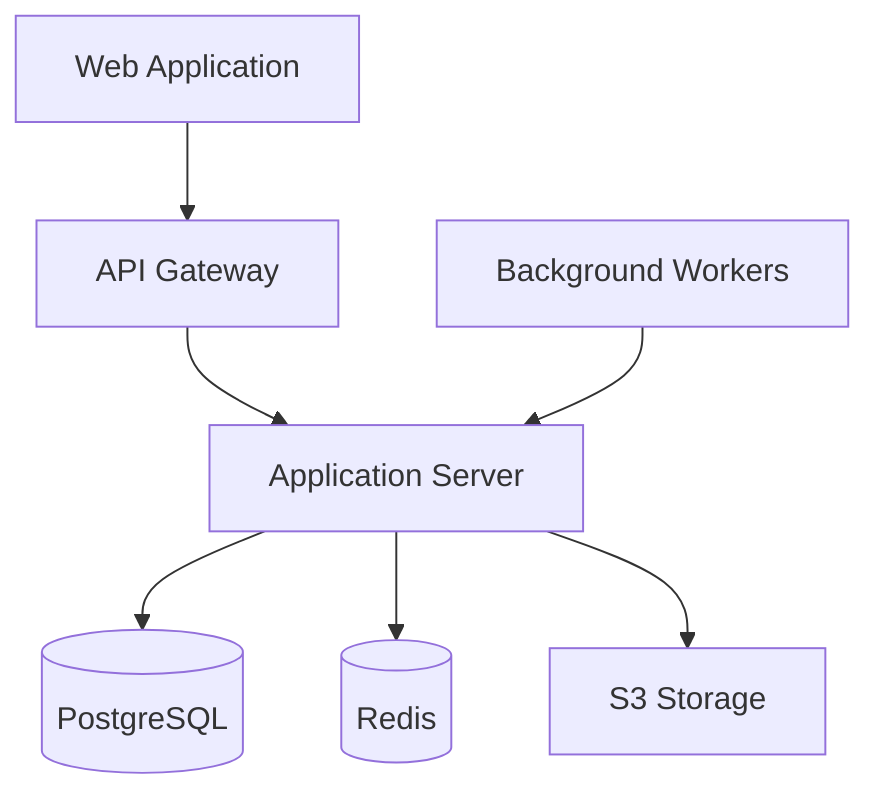

# Arena MVP - Software Evaluation Platform

[](https://github.com/arena/arena-mvp/actions/workflows/ci.yml)
[](https://www.python.org/downloads/)
[](https://www.typescriptlang.org/)
[](LICENSE)

Arena MVP is a web-based software evaluation platform designed to streamline the vendor selection process for business leaders. The platform addresses the critical challenge faced by decision-makers who spend significant time evaluating software vendors through fragmented processes of discovery calls, demos, and manual comparison.

## Key Features

- AI-powered requirement parsing and vendor matching
- Standardized proposal management system
- Anonymous buyer-vendor communication
- Secure document storage and sharing
- Real-time updates via WebSocket
- Role-based security model

## System Architecture



## Quick Start

### Prerequisites

- Docker and Docker Compose
- Python 3.11+
- Node.js 18+
- AWS CLI configured
- Terraform 1.5+

### Installation

```bash
# Clone repository
git clone https://github.com/arena/arena-mvp.git
cd arena-mvp

# Backend setup
cd src/backend
poetry install
docker-compose up -d

# Frontend setup
cd ../web
npm install
npm run dev
```

### Environment Setup

```bash
# Copy environment files
cp src/backend/.env.example src/backend/.env
cp src/web/.env.example src/web/.env

# Configure environment variables
editor src/backend/.env
editor src/web/.env
```

## Development Guide

### Backend Setup (Django/Python)

The backend uses Django 4.2+ with Python 3.11+ and includes:
- Django REST Framework for API development
- Celery for background task processing
- PostgreSQL for primary database
- Redis for caching and sessions

Key commands:
```bash
cd src/backend

# Run development server
poetry run python manage.py runserver

# Run migrations
poetry run python manage.py migrate

# Create superuser
poetry run python manage.py createsuperuser

# Run tests
poetry run pytest
```

### Frontend Setup (React/TypeScript)

The frontend uses React 18+ with TypeScript 5.0+ and includes:
- Tailwind CSS for styling
- Redux Toolkit for state management
- React Hook Form for form handling
- Jest and Cypress for testing

Key commands:
```bash
cd src/web

# Start development server
npm run dev

# Run tests
npm test

# Run linting
npm run lint

# Build for production
npm run build
```

## Infrastructure

### AWS Services

- ECS Fargate for container hosting
- RDS PostgreSQL for database
- ElastiCache Redis for caching
- S3 for document storage
- CloudFront for CDN
- WAF for security

### Terraform Setup

```bash
cd infrastructure/terraform

# Initialize Terraform
terraform init

# Plan changes
terraform plan

# Apply changes
terraform apply
```

## Deployment

### CI/CD Pipeline

The project uses GitHub Actions for CI/CD with the following workflow:
1. Code quality checks (linting, formatting)
2. Run tests (unit, integration)
3. Build Docker images
4. Push to AWS ECR
5. Deploy to staging/production

### Environment Configuration

| Environment | Purpose | Domain |
|-------------|---------|--------|
| Development | Local development | localhost |
| Staging | Pre-production testing | staging.arena.dev |
| Production | Live environment | arena.dev |

### Production Deployment

```bash
# Deploy to staging
make deploy-staging

# Deploy to production
make deploy-production

# Rollback if needed
make rollback version=<version>
```

## Monitoring

- CloudWatch for logs and metrics
- Prometheus for application metrics
- Grafana for visualization
- Sentry for error tracking

## Security

- JWT-based authentication
- Role-based access control
- Data encryption at rest and in transit
- Regular security audits
- OWASP compliance

## Contributing

1. Fork the repository
2. Create a feature branch
3. Commit your changes
4. Push to the branch
5. Create a Pull Request

## License

This project is licensed under the MIT License - see the [LICENSE](LICENSE) file for details.

## Support

For support and questions:
- Create an issue on GitHub
- Contact: support@arena.dev
- Documentation: docs.arena.dev