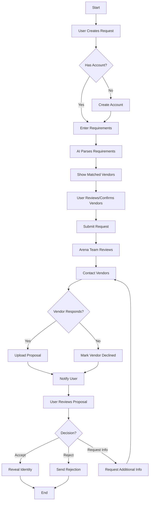
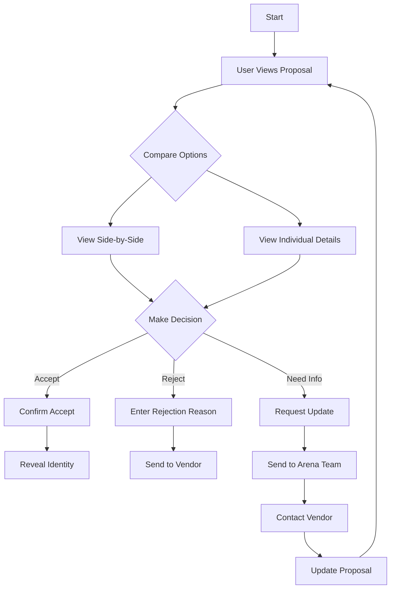
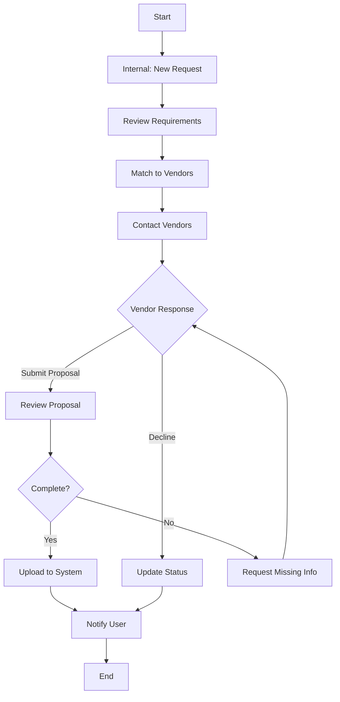
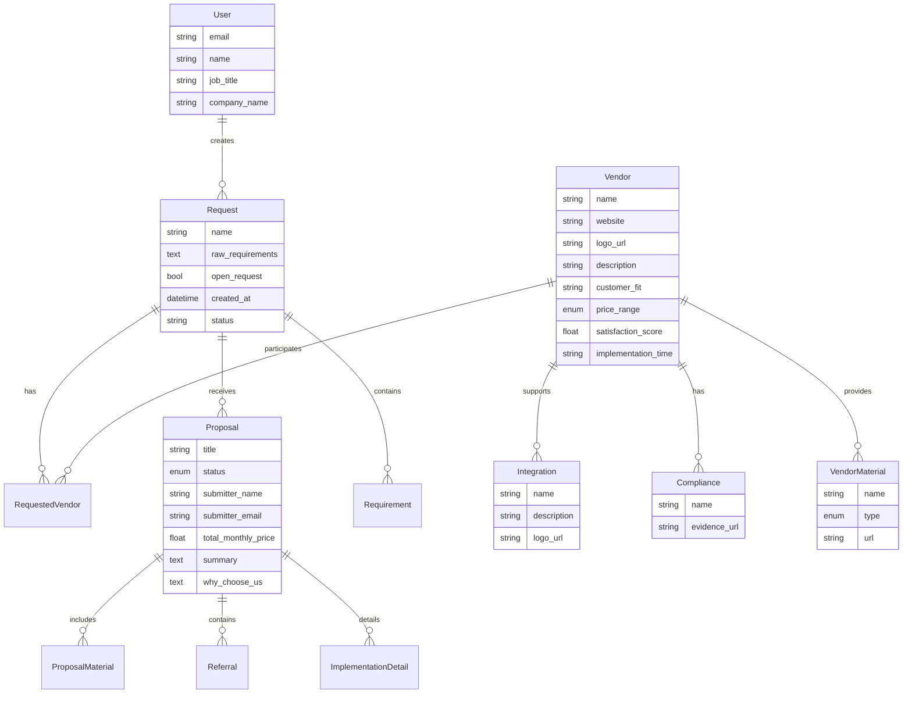
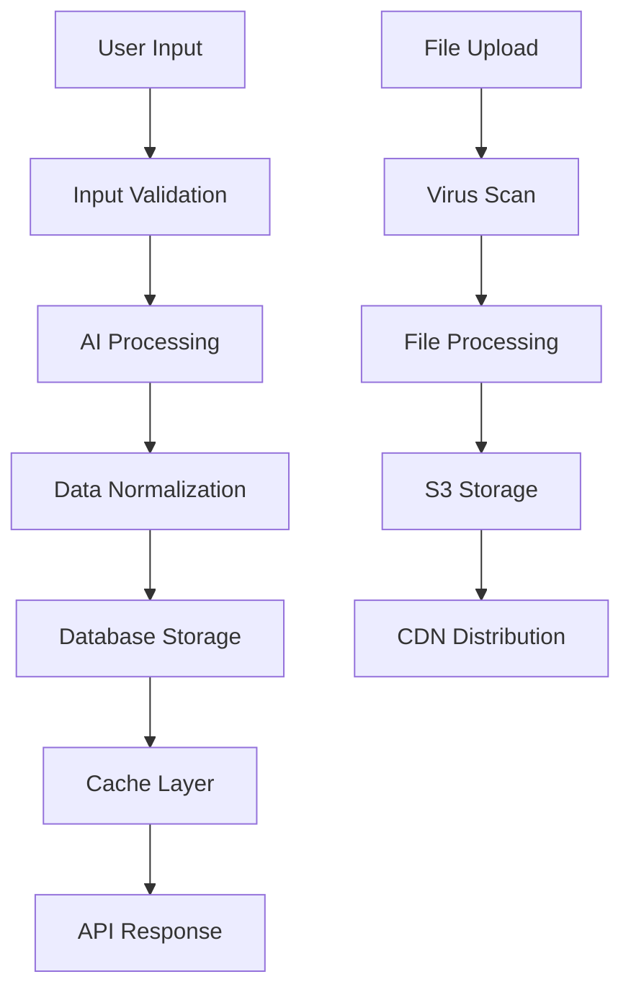

# Product Requirements Document (PRD)

# 1. INTRODUCTION

## 1.1 Purpose

This Product Requirements Document (PRD) defines the comprehensive requirements for Arena MVP, a software evaluation platform that streamlines the vendor selection process for business leaders. This document serves as the primary reference for product managers, developers, designers, and other stakeholders involved in building and delivering the MVP.

## 1.2 Scope

Arena MVP is a web-based platform that enables business leaders to:

- Create structured software evaluation requests with specific requirements
- Receive and review standardized vendor proposals
- Compare multiple vendors in a unified format
- Make informed vendor selection decisions while maintaining anonymity

The platform will focus on:

1. Request Management
   - Free-text and document-based requirement creation
   - AI-powered requirement parsing and structuring
   - Vendor matching and filtering

2. Proposal Management  
   - Standardized vendor proposal collection
   - Side-by-side vendor comparison
   - Proposal status tracking and updates

3. Selection Process
   - Anonymous vendor evaluation
   - Proposal acceptance/rejection workflow
   - Controlled vendor communication

Out of scope items include:
- Revenue collection
- Comprehensive vendor catalog
- Seller-side features
- Team management capabilities
- Operations tools

The MVP will validate two core hypotheses:
1. Buyers find value in a centralized evaluation process
2. Vendors will provide detailed proposals for high-intent anonymous leads

# 2. PRODUCT DESCRIPTION

## 2.1 Product Perspective
Arena MVP is a standalone web-based platform that operates independently while integrating with select external services:
- Anthropic Claude API for AI-powered requirement parsing
- Google Analytics for usage tracking
- Email service for notifications
- Authentication system for user management

The platform serves as an intermediary layer between software buyers and vendors, maintaining separation to preserve buyer anonymity while facilitating structured information exchange.

## 2.2 Product Functions
The core functions of Arena MVP include:

1. Request Management
- AI-assisted parsing of free-text requirements and documents into structured formats
- Vendor matching based on parsed requirements
- Request status tracking and updates

2. Proposal Collection & Review  
- Standardized vendor proposal submission templates
- Side-by-side proposal comparison interface
- Proposal status tracking (Pending, Under Review, Accepted, Rejected)

3. Vendor Selection
- Anonymous vendor evaluation workflow
- Proposal acceptance/rejection process
- Controlled reveal of buyer identity upon selection

4. Information Management
- Secure document storage and sharing
- Vendor catalog maintenance
- Proposal data organization

## 2.3 User Characteristics

Primary Users (Buyers):
- Business leaders and decision makers responsible for software procurement
- Limited time availability for vendor evaluation
- Varying levels of technical expertise
- Need for efficient comparison tools and organized information

Internal Users (Arena Staff):
- Product administrators managing vendor data and proposals
- Customer support handling user requests
- Technical team monitoring system performance

## 2.4 Constraints

Technical Constraints:
- Must maintain user anonymity until explicit reveal
- Limited to web browser-based access
- Manual vendor data management required initially
- No direct vendor platform access in MVP

Business Constraints:
- No revenue collection mechanisms
- Limited to buyer-side features only
- Manual proposal handling by Arena team
- No team collaboration features

## 2.5 Assumptions and Dependencies

Assumptions:
- Buyers will provide accurate business email addresses
- Vendors will submit proposals without direct buyer contact
- Users have basic web browser proficiency
- Internet connectivity is consistently available

Dependencies:
- Anthropic Claude API availability and performance
- Email service reliability
- Google Analytics tracking functionality
- Sufficient manual resources for vendor data maintenance
- Vendor willingness to provide standardized proposal information

# 3. PROCESS FLOWCHART

# 4. FUNCTIONAL REQUIREMENTS

## 4.1 Authentication & User Management

### ID: FR-1
### Description: User authentication and account management functionality
### Priority: HIGH

| Requirement ID | Requirement Description | Acceptance Criteria |
|----------------|------------------------|-------------------|
| FR-1.1 | Support email/magic link authentication | - Users can sign up and login using business email addresses - Magic links are sent for passwordless authentication - Links expire after 15 minutes |
| FR-1.2 | Google OAuth integration | - Users can authenticate using Google business accounts - Required profile information is imported |
| FR-1.3 | Email verification | - New accounts require email verification - Only business email domains are accepted |
| FR-1.4 | Session management | - User sessions persist for 24 hours - Users can logout manually - Concurrent sessions are allowed |

## 4.2 Request Creation

### ID: FR-2  
### Description: Core request creation and requirements gathering functionality
### Priority: HIGH

| Requirement ID | Requirement Description | Acceptance Criteria |
|----------------|------------------------|-------------------|
| FR-2.1 | Free-text requirement input | - Users can enter requirements in natural language - Support for rich text formatting - No character limit |
| FR-2.2 | Document upload | - Users can upload PDFs, DOCs, XLS files - Maximum file size: 10MB - Multiple file upload support |
| FR-2.3 | AI requirement parsing | - Integration with Anthropic Claude API - Structured requirements extracted from text/docs - Results displayed within 5 seconds |
| FR-2.4 | Vendor matching | - Requirements matched to vendor capabilities - Ranked results displayed - Filtering options available |

## 4.3 Proposal Management

### ID: FR-3
### Description: Proposal submission, review and comparison functionality  
### Priority: HIGH

| Requirement ID | Requirement Description | Acceptance Criteria |
|----------------|------------------------|-------------------|
| FR-3.1 | Proposal submission | - Standardized proposal template - Required and optional fields - File attachment support |
| FR-3.2 | Proposal review | - Side-by-side comparison view - Requirement matching indicators - Pricing breakdown display |
| FR-3.3 | Proposal status tracking | - Status updates (Pending/Under Review/Accepted/Rejected) - Email notifications - Status change history |
| FR-3.4 | Additional info requests | - Users can request clarification - Vendors notified of requests - Response tracking |

## 4.4 Vendor Selection

### ID: FR-4
### Description: Vendor evaluation and selection workflow
### Priority: HIGH

| Requirement ID | Requirement Description | Acceptance Criteria |
|----------------|------------------------|-------------------|
| FR-4.1 | Anonymous evaluation | - Vendor identity hidden until selection - Secure information handling - Controlled reveal process |
| FR-4.2 | Proposal acceptance | - Single proposal acceptance - Auto-rejection of other proposals - Identity reveal confirmation |
| FR-4.3 | Proposal rejection | - Rejection reason required - Vendor notification - Status update |
| FR-4.4 | Selection feedback | - Structured feedback collection - Rating system - Optional comments |

## 4.5 Analytics & Reporting

### ID: FR-5
### Description: Usage tracking and analytics functionality
### Priority: MEDIUM

| Requirement ID | Requirement Description | Acceptance Criteria |
|----------------|------------------------|-------------------|
| FR-5.1 | Google Analytics integration | - Event tracking implementation - User journey tracking - Conversion tracking |
| FR-5.2 | User engagement metrics | - Time on page tracking - Feature usage statistics - Drop-off points identified |
| FR-5.3 | Proposal analytics | - View/download tracking - Comparison metrics - Selection patterns |
| FR-5.4 | Performance monitoring | - API response times - Error tracking - System health metrics |

# 5. NON-FUNCTIONAL REQUIREMENTS

## 5.1 Performance Requirements

| Requirement | Description | Target Metric |
|------------|-------------|---------------|
| Response Time | Maximum time for page loads and API responses | - Page loads < 2 seconds - API responses < 1 second - AI parsing < 5 seconds |
| Throughput | System capacity for concurrent users and requests | - Support 100 concurrent users - Handle 1000 requests per hour |
| Resource Usage | Server and client-side resource consumption | - Peak CPU usage < 70% - Peak memory usage < 80% - Client-side memory < 100MB |

## 5.2 Safety Requirements

| Requirement | Description | Implementation |
|------------|-------------|----------------|
| Data Backup | Regular backup of critical system data | - Daily automated backups - 30-day retention period - Encrypted backup storage |
| Failure Recovery | System recovery procedures and failover | - Automated system recovery - Maximum 4-hour recovery time - Data consistency verification |
| Error Handling | Graceful handling of system errors | - User-friendly error messages - Error logging and monitoring - Automatic error notifications |

## 5.3 Security Requirements

| Requirement | Description | Implementation |
|------------|-------------|----------------|
| Authentication | User identity verification | - Email/magic link authentication - Google OAuth integration - Session management |
| Authorization | Access control and permissions | - Role-based access control - Resource-level permissions - Secure API endpoints |
| Data Protection | Security of stored and transmitted data | - Data encryption at rest - TLS 1.3 for data in transit - Secure credential storage |
| Privacy | User data privacy controls | - Anonymous vendor evaluation - Controlled identity reveal - Data retention policies |

## 5.4 Quality Requirements

| Category | Requirement | Target Metric |
|----------|-------------|---------------|
| Availability | System uptime and accessibility | - 99.9% uptime - Planned maintenance windows - Geographic redundancy |
| Maintainability | Code and system maintenance | - Documented codebase - Automated testing - Version control |
| Usability | User interface and experience | - Mobile-responsive design - WCAG 2.1 AA compliance - < 15 min learning curve |
| Scalability | System growth capacity | - Horizontal scaling support - Cloud-native architecture - Microservices ready |
| Reliability | System stability and consistency | - < 0.1% error rate - Automated monitoring - Incident response plan |

## 5.5 Compliance Requirements

| Requirement | Description | Implementation |
|------------|-------------|----------------|
| Data Privacy | Privacy regulations compliance | - GDPR compliance - CCPA compliance - Privacy policy enforcement |
| Security Standards | Industry security standards | - SOC 2 Type II readiness - OWASP Top 10 compliance - Regular security audits |
| Business Compliance | Business operation requirements | - Terms of service - Service level agreements - Vendor contracts |

# 6. DATA REQUIREMENTS

## 6.1 Data Models

## 6.2 Data Storage

### 6.2.1 Storage Requirements

- Primary database: PostgreSQL for relational data storage
- File storage: AWS S3 for documents, images and other binary files
- Cache layer: Redis for session management and frequent queries

### 6.2.2 Data Retention

- User data: Retained for duration of account plus 30 days after deletion
- Request data: Retained for 1 year after completion
- Proposal data: Retained for 1 year after submission
- System logs: Retained for 90 days
- Analytics data: Retained for 2 years

### 6.2.3 Backup & Recovery

- Daily automated full backups to geographically redundant storage
- Point-in-time recovery capability for last 30 days
- Maximum 4-hour recovery time objective (RTO)
- Recovery point objective (RPO) of 24 hours
- Monthly backup restoration testing

## 6.3 Data Processing

### 6.3.1 Data Flow

### 6.3.2 Data Security

- Encryption at rest using AES-256
- TLS 1.3 for data in transit
- Role-based access control (RBAC)
- Data anonymization for vendor-facing information
- Regular security audits and penetration testing
- Automated vulnerability scanning

### 6.3.3 Data Validation

- Input sanitization for all user-provided data
- Schema validation for API requests
- File type and size restrictions for uploads
- Business logic validation for proposals
- Duplicate detection for vendor submissions

### 6.3.4 Data Integration

- Anthropic Claude API integration for requirement parsing
- Google Analytics for usage tracking
- Email service provider integration
- Authentication service integration
- Monitoring and logging service integration

# 7. EXTERNAL INTERFACES

## 7.1 User Interfaces

### 7.1.1 Web Application Interface

| Component | Description | Requirements |
|-----------|-------------|--------------|
| Responsive Design | Mobile-first responsive web interface | - Support viewport sizes 320px to 2560px - Breakpoints at 768px, 1024px, 1440px - Fluid typography scaling |
| Navigation | Primary navigation menu | - Persistent top navigation bar - Mobile hamburger menu - Active state indicators |
| Forms | Request creation and proposal forms | - Field validation - Error messaging - Progress indicators - Auto-save functionality |
| Tables | Proposal comparison views | - Sortable columns - Filterable rows - Horizontal scrolling on mobile - Fixed headers |
| Document Viewer | PDF and document preview | - In-browser document rendering - Download options - Basic zoom controls |
| Notifications | System alerts and messages | - Toast notifications - Modal dialogs - Loading states |

### 7.1.2 Design System

| Element | Specification |
|---------|--------------|
| Typography | - Primary: Inter - Secondary: System fonts - Base size: 16px |
| Colors | - Primary: #2563EB - Secondary: #64748B - Success: #22C55E - Error: #EF4444 |
| Spacing | - Base unit: 4px - Scale: 4, 8, 12, 16, 24, 32, 48, 64px |
| Components | - Follow WCAG 2.1 AA standards - Support dark/light modes - Consistent interaction patterns |

## 7.2 Software Interfaces

### 7.2.1 External APIs

| Interface | Purpose | Specifications |
|-----------|----------|---------------|
| Anthropic Claude API | AI-powered requirement parsing | - REST API - Authentication: API key - Rate limit: 10 req/sec - Response time: < 5s |
| Google Analytics | Usage tracking and analytics | - GA4 implementation - Event tracking - Custom dimensions - User properties |
| Email Service | Notification delivery | - SMTP/API integration - HTML/text formats - Delivery tracking - Bounce handling |

### 7.2.2 Storage Services

| Service | Purpose | Specifications |
|---------|----------|---------------|
| AWS S3 | Document and file storage | - Region: us-east-1 - Bucket policies - CORS configuration - Encryption: AES-256 |
| PostgreSQL | Primary database | - Version: 14+ - Connection pooling - SSL encryption - Daily backups |
| Redis | Caching and sessions | - Version: 6+ - Persistence: RDB - Memory limit: 1GB - Key expiration |

## 7.3 Communication Interfaces

### 7.3.1 Network Protocols

| Protocol | Usage | Requirements |
|----------|--------|--------------|
| HTTPS | All web traffic | - TLS 1.3 - Certificate: Let's Encrypt - HSTS enabled - Perfect forward secrecy |
| WebSocket | Real-time updates | - Secure WebSocket (wss://) - Heartbeat mechanism - Auto-reconnection - Message queuing |

### 7.3.2 Data Formats

| Format | Usage | Specifications |
|--------|--------|---------------|
| JSON | API responses | - UTF-8 encoding - Camel case keys - ISO 8601 dates - Nullable fields |
| CSV | Data exports | - UTF-8 with BOM - RFC 4180 compliant - Header row required - Quoted strings |
| PDF | Document viewing | - PDF/A compliance - Maximum size: 10MB - Text extraction support - Preview generation |

# 8. APPENDICES

## 8.1 GLOSSARY

| Term | Definition |
|------|------------|
| Arena | The software evaluation platform being developed in this PRD |
| Lead | A potential software buyer who has submitted a request through Arena |
| Proposal | A formal response from a vendor containing pricing, features, and other requested information |
| Request | A structured software evaluation inquiry created by a buyer |
| Vendor | A software company that may submit proposals through Arena |
| Cart/Arena | The collection of vendors selected by a buyer to receive proposals from |
| Perfect Match | A vendor that meets all specified requirements in a request |
| Partial Match | A vendor that meets some but not all specified requirements |

## 8.2 ACRONYMS

| Acronym | Definition |
|---------|------------|
| API | Application Programming Interface |
| AWS | Amazon Web Services |
| CCPA | California Consumer Privacy Act |
| CDN | Content Delivery Network |
| CORS | Cross-Origin Resource Sharing |
| FK | Foreign Key |
| GDPR | General Data Protection Regulation |
| HSTS | HTTP Strict Transport Security |
| MVP | Minimum Viable Product |
| OWASP | Open Web Application Security Project |
| PRD | Product Requirements Document |
| RBAC | Role-Based Access Control |
| RFP | Request for Proposal |
| S3 | Simple Storage Service (AWS) |
| SOC | Service Organization Control |
| TLS | Transport Layer Security |
| URL | Uniform Resource Locator |
| UTF-8 | Unicode Transformation Format - 8-bit |
| WCAG | Web Content Accessibility Guidelines |

## 8.3 ADDITIONAL REFERENCES

| Resource | Description | URL |
|----------|-------------|-----|
| Anthropic Claude API Documentation | API documentation for AI integration | https://docs.anthropic.com/claude/reference |
| AWS S3 Documentation | Documentation for file storage implementation | https://docs.aws.amazon.com/s3/ |
| GDPR Compliance Guidelines | Privacy compliance requirements | https://gdpr.eu/compliance/ |
| OWASP Top 10 | Web application security risks and mitigations | https://owasp.org/Top10 |
| WCAG 2.1 Guidelines | Accessibility compliance requirements | https://www.w3.org/WAI/WCAG21/quickref/ |