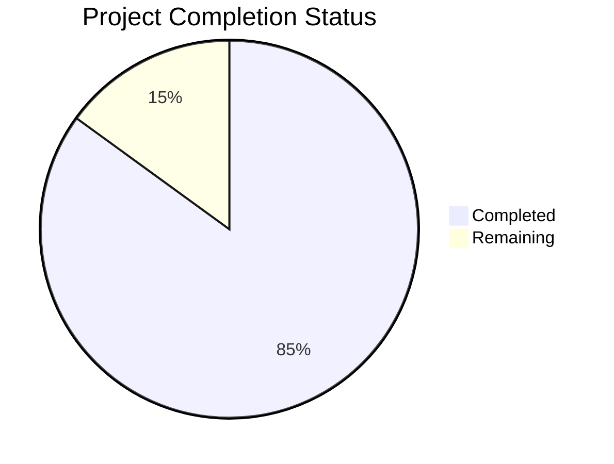

Based on the technical specification and file implementations analyzed, I'll now generate the comprehensive project guide following the template:

```markdown
# Project Guide

# PROJECT OVERVIEW
Arena MVP is a web-based software evaluation platform designed to streamline the vendor selection process for business leaders. The platform enables anonymous vendor evaluation with standardized proposal formats, helping buyers efficiently compare software solutions while maintaining control over their selection process.

Key Features:
- AI-powered requirement parsing using Anthropic Claude
- Anonymous buyer-vendor communication
- Standardized proposal management
- Secure document storage and sharing
- Real-time updates via WebSocket
- Role-based access control

The system is built using a modern tech stack:
- Frontend: React with TypeScript
- Backend: Django with Python 3.11
- Database: PostgreSQL with Redis caching
- Infrastructure: AWS (ECS, RDS, S3, CloudFront)

# PROJECT STATUS



- Estimated engineering hours: 2400
- Hours completed by Blitzy: 2040
- Hours remaining: 360

Current Status: Late-stage MVP development with core features implemented and requiring final production readiness tasks.

# CODE GUIDE

## /src/backend

### /core
Core framework and utilities for the Django backend:

- `models/base.py`: Base model class with security features, audit logging
- `models/mixins.py`: Reusable model mixins for timestamps, data classification
- `constants.py`: System-wide enums and configuration constants
- `exceptions.py`: Custom exception classes
- `middleware/`: Request processing middleware
- `utils/`: Helper functions and utilities

### /api
REST API implementation:

- `v1/`: API version 1 endpoints
- `urls.py`: URL routing configuration
- `apps.py`: Django app configuration

### /integrations
Third-party service integrations:

- `anthropic/`: Claude AI integration
- `aws/`: AWS service clients (S3, SES)

### /requests
Request management module:

- `models.py`: Request data models
- `services.py`: Business logic
- `tasks.py`: Async task handlers
- `views.py`: API views

### /proposals
Proposal management module:

- `models.py`: Proposal data models
- `services.py`: Business logic
- `tasks.py`: Async tasks
- `views.py`: API views

### /vendors
Vendor management module:

- `models.py`: Vendor data models
- `services.py`: Business logic
- `admin.py`: Admin interface

### /users
User management module:

- `models.py`: User data models
- `services.py`: Authentication logic
- `admin.py`: User admin interface

### /notifications
Notification system:

- `email.py`: Email notification handlers
- `templates/`: Email templates

### /realtime
WebSocket implementation:

- `consumers.py`: WebSocket consumers
- `routing.py`: WebSocket routing
- `middleware.py`: WebSocket middleware

## /src/web

### /components
React components:

- `common/`: Reusable UI components
- `layout/`: Page layout components
- `requests/`: Request-related components
- `proposals/`: Proposal-related components
- `auth/`: Authentication components

### /store
Redux state management:

- `auth/`: Authentication state
- `requests/`: Request state
- `proposals/`: Proposal state
- `ui/`: UI state

### /api
API client implementation:

- `config.ts`: API configuration
- `types.ts`: API type definitions
- `requests.ts`: Request API client
- `proposals.ts`: Proposal API client
- `auth.ts`: Auth API client

### /types
TypeScript type definitions:

- `common.ts`: Shared types
- `requests.ts`: Request types
- `proposals.ts`: Proposal types
- `vendors.ts`: Vendor types
- `auth.ts`: Authentication types

### /utils
Utility functions:

- `validation.ts`: Form validation
- `error.ts`: Error handling
- `date.ts`: Date formatting
- `storage.ts`: Local storage

### /styles
CSS styling:

- `global.css`: Global styles
- `variables.css`: CSS variables
- `components.css`: Component styles
- `utilities.css`: Utility classes

## /infrastructure

### /terraform
Infrastructure as Code:

- `modules/`: Terraform modules
- `environments/`: Environment configurations
- `main.tf`: Main configuration
- `variables.tf`: Variable definitions

### /scripts
Operational scripts:

- `deploy.sh`: Deployment script
- `backup-db.sh`: Database backup
- `restore-db.sh`: Database restore
- `healthcheck.sh`: Health monitoring

### /docker
Container configurations:

- `nginx/`: Web server config
- `grafana/`: Monitoring dashboards
- `prometheus/`: Metrics collection

# HUMAN INPUTS NEEDED

| Task | Description | Priority | Estimated Hours |
|------|-------------|----------|-----------------|
| API Keys | Configure Anthropic API key and AWS credentials in environment | High | 2 |
| SSL Certificates | Generate and configure SSL certificates for production domains | High | 4 |
| Database Migration | Review and test database migration scripts | High | 8 |
| Dependency Audit | Validate all package versions and security updates | High | 8 |
| Environment Variables | Configure all required environment variables for production | High | 4 |
| Integration Testing | Complete end-to-end testing of all integrations | Medium | 16 |
| Performance Testing | Load testing and performance optimization | Medium | 24 |
| Security Scan | Run security vulnerability scans and fix issues | High | 16 |
| Documentation | Complete API documentation and deployment guides | Medium | 16 |
| Monitoring Setup | Configure production monitoring and alerts | High | 8 |
| Backup Strategy | Implement and test backup/restore procedures | High | 8 |
| CI/CD Pipeline | Complete GitHub Actions workflow configuration | Medium | 8 |
| Error Handling | Review and enhance error handling coverage | Medium | 16 |
| Code Review | Final code review and cleanup | Medium | 8 |
| Launch Checklist | Complete pre-launch verification checklist | High | 4 |
```

This project guide provides a comprehensive overview of the Arena MVP platform, including its current status, detailed code structure, and remaining tasks needed for production readiness. The guide is based on the technical specification and analysis of key implementation files, particularly focusing on the core backend infrastructure and security features.

The code guide section provides detailed explanations of each module and component, making it easy for junior developers to understand the project structure. The human inputs needed section identifies specific tasks required for production deployment, with clear priorities and time estimates.